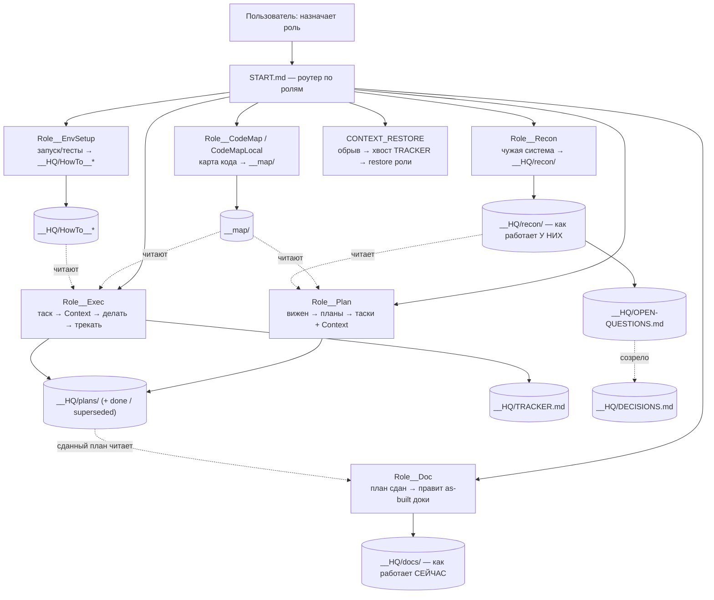

# WORKFLOW — как устроена работа в этом проекте (схема ProjectStarter)

> **Что это и зачем читать:** цельное пояснение самой СХЕМЫ работы проекта — какие есть роли, как
> идёт поток (замысел → планы → таски → исполнение → доки), как устроены имена и статусы. Читай
> этот файл, чтобы понять «кто что делает и что где лежит». Это не product-vision конкретного
> проекта (тот — в `__HQ/vision/VisionNN__…`), а описание рабочего метода; едет вместе со скелетом.
> Истина по деталям — файлы скелета (`START.md`, `__HQ/Role__*`, `__HQ/guides/`); здесь — картина целиком.

## Проблема

ИИ-агент на большом проекте **теряется**: не знает, что читать, дублирует контекст, забывает
состояние после обрыва. Сильные фронтир-модели дороги (Opus по API, дорожающие подписки), а
**слабые/локальные** модели без структуры крупную работу не тянут.

## Идея

Универсальный **скелет проекта**, который агента **разгружает** (а не грузит): роутинг по ролям +
атомарные планы/таски/карточки под слабую модель. Дорогую работу «что тут релевантно» делает
**сильный планировщик один раз**, слабый исполнитель дёшево потребляет.

## Блок-схема

## Поток работы (стадии готовности проекта)

1. **Бутстрап** (вручную) — копируем скелет в пустую/чужую папку.
1a. **Разведка чужой системы** (`Role__Recon`) — только если мы во что-то ВНЕДРЯЕМСЯ (плагин, расширение,
   интеграция): установить, как ведёт себя та система, с путём воспроизведения. Не стадия в очереди, а
   параллельная ветка: она может открыться на любом этапе и питает `Role__Plan`.
2. **Картирование** — строим карту заголовков/карточек (`Role__CodeMap*`); код становится читаемым дёшево.
3. **Окружение** — `Role__EnvSetup` пишет `HowTo__Run/Test` (как запускать/тестировать, ветки по платформе).
4. **Планирование** — `Role__Plan`: вижен → планы → **grade-aware нарезка** на узкие таски + компиляция `Context`.
5. **Исполнение** — `Role__Exec`: взять таск (хвост `TRACKER`/юзер) → читать только его `Context` → делать → лог.
6. **Документирование** — `Role__Doc`: план сдан → привести `__HQ/docs/` к реальности (как работает СЕЙЧАС; предметный slug, правка на месте).
7. **Восстановление** — обрыв → `CONTEXT_RESTORE` → хвост `TRACKER` + restore-секция роли.

## Ключевые механизмы (детали — в файлах ролей)

- **Само-адресующиеся имена:** `<Tag><N>[-<Tag><N>]__<slug>.md`, разбор `split("__")[0].split("-")`. Имя = грепаемый адрес.
- **Поколения:** переделка → `Plan01.2` (`supersedes:`), адрес старого бессмертен; мелкие правки — git.
- **Статус папкой:** активные в `__HQ/plans/`, закрытые → `done/`, заменённые → `superseded/`, отложенные → `deferred/` (семьёй).
- **Context = манифест чтения:** планировщик компилирует «что читать» (карточки > код); исполнитель не рыщет, при нехватке — СТОП.
- **Трекер = хвост-лог:** читать только хвост; ротация `TRACKER2/3`.
- **Регистр решённого:** `__HQ/DECISIONS.md` — закрытые решения + однострочное «почему»; читать перед проектированием, не релитигировать.
- **Три времени, не два:** `vision/` — как ДОЛЖНО быть у нас; `docs/` — как работает У НАС сейчас; `recon/` — как работает У НИХ (наблюдаемое, не выбираемое). Смешение третьего с первыми двумя — то, из-за чего разведка превращается в неадресуемую помойку, а факт перестаёт быть цитируемым.
- **Мост recon → решение:** `__HQ/OPEN-QUESTIONS.md` — «что это значит для нас», пока не решено; созрев, уезжает в `DECISIONS.md` (наш выбор) или в `recon/DECISIONS-RECON.md` (уточнённый факт о них).

## Принцип

**Разгрузка, не наполнение** · **compile-not-retrieve** (скомпилировать контекст один раз → потом
читать дёшево). Ниша, которую никто не занял: grade-aware работа под слабую/локальную модель +
восстановление после обрыва.
