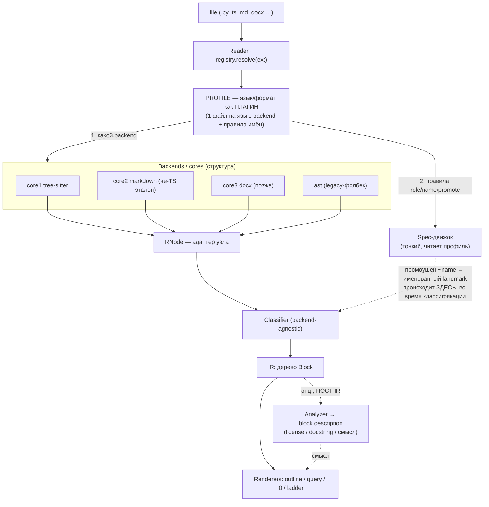

# get_codeblock → Vision 03: универсальный ридер (сменные backend'ы + слой-переводчик)

**Дата:** 2026-08-19. **Статус:** идеология зафиксирована, не реализовано.
Продолжение `Vision02__get_codeblock.md` (там — универсальный `.0`-классификатор и таблица ролей).
Vision02 обобщил ось ЯЗЫКОВ на одном движке; Vision03 обобщает ось **BACKEND'ов**.

## Ключевая цель

Утилита должна стать **универсальным ридером**: `--outline` открывает ЛЮБОЙ незнакомый файл и
сразу даёт карту («книжку»), а движки под капотом могут быть разными. Добавление нового языка или
формата — **простое**: новый backend + тонкий слой, переводящий вывод backend'а в единый формат
запросов утилиты. Renderer'ы (outline/query/.0/ладдер) при этом не трогаются вообще.

## Архитектура — компиляторный split frontend → IR → backend

Мы уже имеем ~80% этого неявно; Vision03 делает швы явными.

```
Reader → REGISTRY[ext] → (Spec-декоратор → core1 tree-sitter → Node-адаптер) ┐
                       → (docx-декоратор → core2 office → эмитит IR напрямую) ├→ IR → Renderers
                       → (pdf-декоратор  → core3 …)                           ┘   (DotEntry)  (outline/query/.0)
```

## Целевая схема (что ДЕЛАЕМ)

Это карта того, куда идём (в `reader/CONTRACT.md` — карта того, что уже сделано). Ключевая идея:
**язык = ПРОФИЛЬ-плагин** — один файл на язык, который отвечает за две вещи: (1) какой backend
подключить и (2) как назвать то, что backend отдал (промоушен `~name → именованный landmark`).



**Два разных «языковых» действия — не путать:**
- **Промоушен / имя** (`~expression_statement` → `DEFAULT_CONFIG`): МЕНЯЕТ структуру (разрывает
  filler-полосу, добавляет именованный узел) → обязан идти ВО ВРЕМЯ классификации, живёт в **профиле
  (Spec)**. Прецедент — `_arrow_binding_value` (`NAME = () => {}`).
- **Описание / смысл** («license-блок», «docstring»): структуру НЕ меняет → строго **пост-IR
  Analyzer**, только `block.description`.

**Профиль (плагин языка) как plug-and-play.** Сейчас весь язык-нюанс свален в один `TreeSitterSpec`
(`_arrow_binding_value`, `_EXTRA_FRAME_TYPES`) — по мере роста это свалка `if language == X`. Цель:
per-language модули `profiles/<lang>.py`, декларативно объявляющие extra-frames / binder-типы /
value-типы / «многострочный литерал → landmark»; `TreeSitterSpec` становится тонким движком над
профилем. Новый язык = новый файл-профиль (Vision03 «новый язык = запись данных»). Первое правило,
которое ложится в профиль, — const-промоушен из Итерации 2.

**Слои и общий словарь:**
- **Reader (роутер, единый путь):** файл → определить формат → выбрать (backend, spec). ОДИН вход.
- **Backend / Core:** превращает файл в нормализованное дерево. core1 = tree-sitter (код),
  core2 = office (.doc/.docx), core3 = pdf, core4 = plain/markdown, …
- **Декоратор (Spec):** нюансы формата — таблица ролей `{landmark | filler | frame}` + как достать
  имя/тело узла. Для tree-sitter = `LangSpec` + `_EXTRA_FRAME_TYPES`. Rust/Go = просто новый Spec.
- **IR (промежуточное представление):** уже существует — `DotEntry` (kind/type/name/range/level/
  children). Это и есть «формат запросов утилиты», в который переводит слой-переводчик.
- **Renderers:** outline / query / .0 / ладдер — потребляют IR, backend им безразличен.

## Два шва, которые делают это plug-and-play

1. **Node-адаптер (backend seam).** Крошечный протокол узла: `type, children, start_row, end_row,
   text, field(name)`. tree-sitter-узел ему почти соответствует — обернуть тонко. Именно адаптер
   отвязывает `.0`-классификатор от прямого tree-sitter-API (`.named_children`/`.start_point`/
   `.child_by_field_name`) и позволяет существовать не-tree-sitter backend'ам.
2. **Единый реестр (router seam).** `REGISTRY[ext] = Format(name, backend, spec)` — ОДИН источник
   правды вместо сегодняшних 5 мест диспетчеризации (`lang_map` ×3 в `core.py`, `get_handler` в
   `handlers/__init__.py`, `_spec_for_ext` в `dot_classify.py`). После этого новый tree-sitter-язык =
   **одна строка данных**.

## Инварианты (в дополнение к Vision01/Vision02)

- **Renderer'ы backend-agnostic.** Ни один режим вывода не знает, из чего построено дерево.
- **Добавить tree-sitter-язык = один Spec-энтри** (грамматика + таблица ролей), без правки ядра и
  рендеров. Rust (`tree_sitter_rust`), Go (`tree_sitter_go`) — доказательство.
- **Добавить формат = новый backend, эмитящий IR.** .docx/.pdf сами по себе — уже scope-дерево
  (заголовок → раздел → подраздел; абзацы = filler), так что backend просто строит `DotEntry`.
- **Единый вход.** Всё подключается через один реестр; частные декораторы не создают частных путей.

## Не переписываем — консолидируем

Tree-sitter-ядро, машина уровней/рамок, склейка преамбулы, `.0`-классификатор — остаются. Vision03
не рвёт: он (а) собирает размазанный диспетчер в реестр, (б) вставляет тонкий Node-адаптер, (в)
открывает дорогу core2+. Каждый шаг самостоятелен и проверяем. Конкретные шаги — в
`Plan__universal-reader.md`.

**Практический контракт «как добавить слой»** (рецепты A/B/C: язык / backend / analyzer + инварианты)
живёт рядом с реализацией: `__HQ/tools/get_codeblock/reader/CONTRACT.md`.
