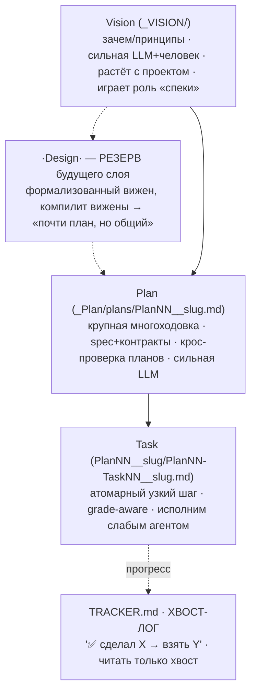
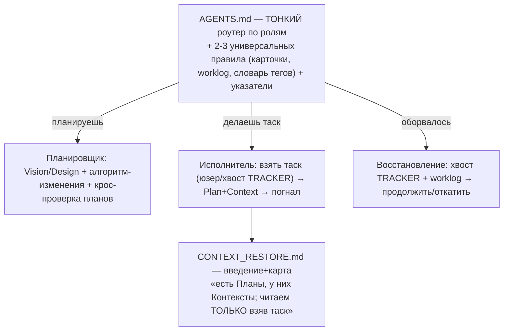
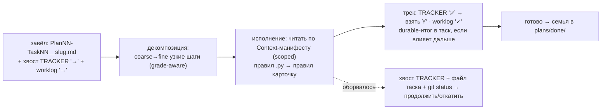

# Инфраструктура задач проекта — СХЕМА (консолидировано 2026-08-03)

> Статус: **структурный слой ЗАПЕРТ.** Осталось содержательное (шаблоны, формат лога,
> алгоритм вижена) — см. §13. Перед миграцией — adversarial-разбор Сонетом.
> Потребитель рецепта — **ЛЛМ** (в идеале слабая/локальная): атомарные файлы > один большой.
> Сквозной принцип — **РАЗГРУЗКА агента, не наполнение** (`_VISION/Principles.md`).

## 1. Зачем

Собрать разрозненные заготовки (`_Plan/plans/`, `TRACKER.md`, `CONTEXT_RESTORE`, worklog,
`_map/cards`) в **простой рецепт задачи**: папки / файлы / поток данных. Рекурсия: это **сам
memohood, применённый к нашей стройке** — compile-not-retrieve для задач (контекст задачи
компилируем один раз → исполнитель читает дёшево).

## 2. Три слоя (грейд-тир: планирование почти невозможно на слабой модели)



## 3. Адресация и имена

**Теги — полные слова, латиница** (самоописательны, ≈1 токен, роутят даже тупого агента,
грепаются чисто): `Plan` · `Task` · `Context` · `Vision`. `Design` — **зарезервирован** под слой §2.

**Разделители (иерархия):**
- `__` — граница **адрес ↔ slug** (старший).
- `-` — между **координатами внутри адреса** (уровни дерева).
- `.` — **поколение/версия узла** (`Plan01.2` = новый заход на область Plan01, см. §6).

**Self-addressing:** имя несёт **ПОЛНЫЙ адрес** (не выводим из пути) — чтобы хвост-лог/restore
находили узел грепом.
```
Plan01__lab.md
Plan01-Task08__extract.md
Plan01-Task08-1__seed-loop.md      # подтаск — голый номер на листе (редко)
Plan01-Context__backends-setup.md
```
**Парсер:** `split("__")[0].split("-")` → уровни `[Plan01, Task08, 1]`. Slug (после `__`) держит
свои `-` свободно. **ДНК с карточками = эта грамматика/парсер, а не слова** (карточки — числовой
regnum, таски — слова; один хелпер `address(имя)` читает оба).

- **Подтаск** — голый номер (`-1`), большая редкость; нужна реальная нарезка → это **отдельный таск**.
- **Slug** — тема, латиница (`backends-setup`).

## 4. Фрактальный узел + структура папок

**Любой узел = `<адрес>__<slug>.md` (спека) + одноимённая папка для детей.** Папку заводим
**только когда детей дофига**; иначе дети — файлами рядом.

```
_Plan/plans/
  Plan01__lab.md                       # активный план (лежит прямо тут = активный)
  Plan01__lab/                         # дети плана
    Plan01-Task08__extract.md
    Plan01-Context__backends-setup.md
    Plan01-Task08__extract/            # ← папка ТОЛЬКО если у Task08 дофига подтасков
      Plan01-Task08-1__seed-loop.md
  Plan02__cardstore-index.md
  Plan02__cardstore-index/
    Plan02-Task01__naming.md
  done/                                # доделанные чейны (семьёй)
  superseded/                          # заменённые чейны (семьёй, + ссылки)
TRACKER.md                             # хвост-лог
```

## 5. Статус — папкой на уровне ЧЕЙНА (не потасково)

- **Активные** планы — россыпью в `plans/` (отсутствие в архиве = живой).
- `plans/done/` — доделанные; `plans/superseded/` — заменённые. Переезжает **вся семья**
  (план + все таски) как единое целое.
- **Таск-прогресс НЕ папкой** (иначе churn + папка плана пустеет) — он в **хвост-логе**.
- Первый поиск = картина состояний, **не открывая файлы**:
  `plans/*__*.md` (активные) · `plans/done/**` · `plans/superseded/**` · хвост TRACKER (фронтир).
  (`*__*.md` отсекает служебные `TRACKER.md`/`README.md` — `__` = подпись адресованного узла.)

## 6. Поколения / ревизии

- **Мелкая правка** текста плана (опечатка, уточнение) → это **git**, адрес тот же.
- **Настоящая переделка** (новые таски, старый заход брошен/закрыт) → **новое поколение**
  `Plan01.2` со своими тасками (`Plan01.2-Task01…`), frontmatter `supersedes: Plan01`; старый
  уезжает в `superseded/` с `superseded_by: Plan01.2`. Пример: лаба v1 (глупая) → `superseded/`,
  `Plan01.2__lab` (умная итерация) живёт в `plans/`.
- **Адрес бессмертен внутри поколения**: дети `Plan01` не переименовываются. Версии — в `## История`
  (append-only, autograph-стиль) + git. Таск пинится к ревизии плана полем `plan_rev:` во frontmatter.

## 7. Context — компилированный манифест чтения

Пишет **планировщик** (он в контексте) → исполнитель **потребляет**, не рыская. Дорогая работа
«что релевантно» переезжает к сильному один раз с плеч слабого каждый прогон.

- **Точность там, где уверен** (факт инлайном: «harrier dims 640»); **грубая зона там, где нет**
  (`backends/ — как _chat_once строит тело`). Не фейкать `§`-точность.
- **Дефолт:** маленький/общий контекст = **секция в файле плана**. Отдельный `Context`-узел
  (`Plan01-Context__…`, при нужде `Context1`/`Context2`) — только если дофига или разные зоны под
  под-множества тасков.
- **Улучшается по фидбеку:** исполнитель уткнулся → дописал в Context, чего не хватило → следующий
  точнее (compile-once-refine-over-time).
- **Страховочный клапан:** манифеста не хватило → исполнитель **СТОП + доложил/дополнил**, НЕ слепой
  поиск. Грейд-aware: слабый эскалирует, сильный добирает и помечает.

## 8. TRACKER = хвост-лог

Определения планов/тасков **уезжают в свои атомарные файлы**. Трекер тонкий:
- сверху — компактная **статичная карта фаз** (редко меняется);
- снизу — **аппенд строки прогресса**, новейшая последней: `✅ Plan01-Task07 → следующий Plan01-GO/NO-GO`.
- **Правило чтения: только ХВОСТ.** Восстановление задом-наперёд: хвост → какие таски → читать
  план+контекст → или ничего (добрать из готовых интерфейсов).
- **Следующий таск — из хвоста** (или от юзера), НЕ читая план целиком.

## 9. Прогресс: волатильное vs durable

- **Волатильное** — хвост-лог TRACKER (тики/фронтир).
- **Durable** — **резюме-итог в файле таска ТОЛЬКО если влияет на следующий таск** (найденное
  ограничение, изменённый контракт, решение). Не «сделал», а «вот что важно дальше» — «редко но метко».
- Раскол durable(файлы/git) / volatile(лог) — принцип 6.

## 10. Вход: `AGENTS.md` = тонкий роутер по РОЛИ



- **Закон:** `AGENTS.md` **обязан остаться ТОНКИМ** (грузится всегда; раздуется → повторим грех
  `hermes-src` с 1433-строчным AGENTS.md = антипаттерн). Роутер направляет и умывает руки — содержание
  веток по ссылкам.
- Написан **по-человечески** («делаешь таск → сюда»), чтобы тупой исполнитель **сам себя сроутил**.
- **Гейтинг:** план/контекст грузим **лениво, под взятый таск**, не веером.
- `CONTEXT_RESTORE.md` — спец-синглтон (как `TRACKER.md`), имя оставляем (роутит собой). Содержание допилим.

## 11. Жизненный цикл задачи (поток данных)



## 12. Что крадём / наша ниша (grounding)

- **Converged (крадём):** пайплайн spec→plan→tasks; раскол истина↔в-полёте↔архив
  (`_VISION` ↔ `plans/` ↔ `done/`+`superseded/`).
- **Наше (пустая ниша):** grade-aware нарезка под **слабую/локальную** модель + **restore-after-interruption**.
- **Референсы:** `planning-with-files` (механика восстановления) · `autograph` — референс **слоя
  обслуживания карточек** (отдельная тема: schema-as-code, Compiled-Truth+History, decay, MOC).

## 13. Ещё НЕ написано (следующее, до Сонета)

1. **Шаблоны** `Plan` / `Task` / `Context` (секции; в таске — grade-aware нарезка = наша ниша).
2. **Формат строки хвост-лога** (точный вид `✅/→`).
3. **Алгоритм изменения вижена** + чек структуры (вижен растёт с проектом — сильная LLM держит когерентность).
4. **Рецепт восстановления** одностраничником (glob + хвост).
5. **План миграции** (`Ф1-К1..К7 → Plan01-Task01..07`; перекрой TRACKER; вынос тасков в файлы).

## 14. Процесс

**(1) финал схемы → (2) Сонет adversarial-разбор дыр → (3) миграция.** Только зелёный ствол,
отдельными безопасными коммитами.
